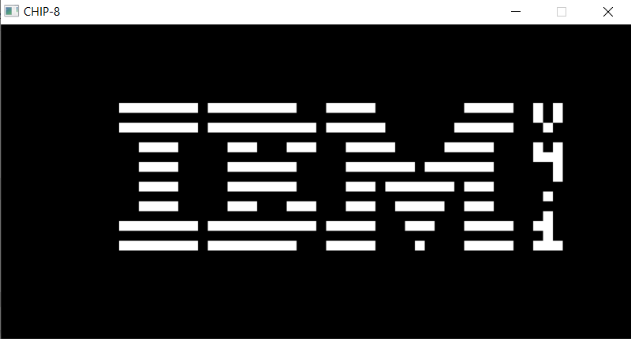
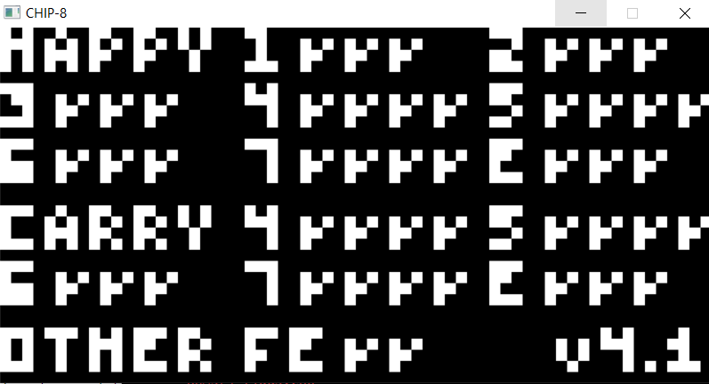
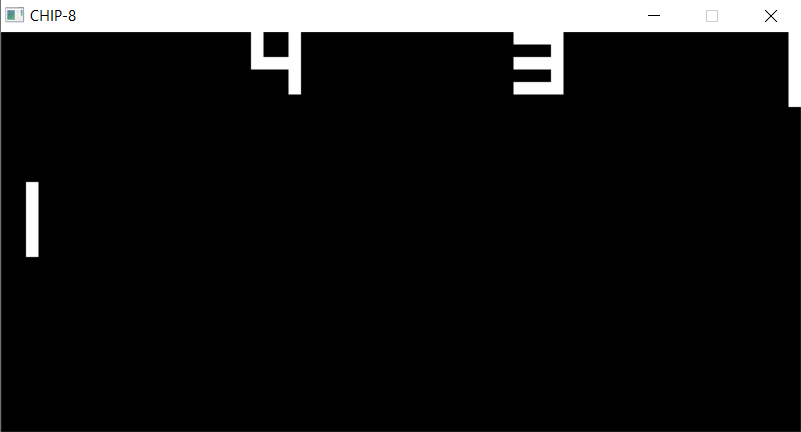
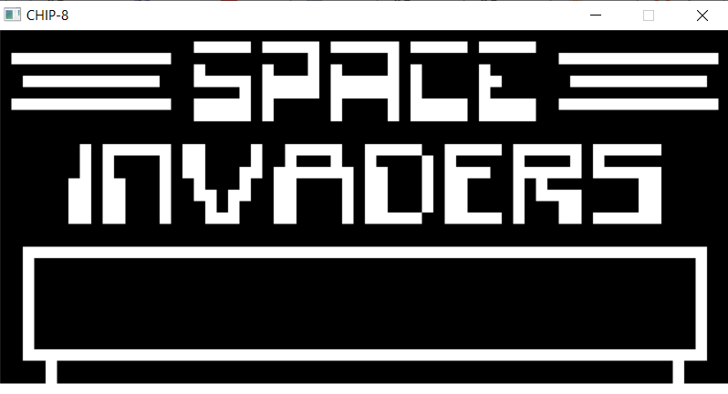

# Chip-8 "Emulator"

This project allows the execution of ROMs designed to run on CHIP-8 machines.

This is technically an interpreter, since CHIP-8 is a programming language, but since this program emulates CPU components as well, it might be called an emulator

## About the Project

This is a mostly fully-functioning CHIP-8 emulator, however it lacks sound currently

This was written in pure C++ and makes use of classes to define a System class to loop through the CPU cycles and poll for input from the SDL context

## Using This Repo

You can use the MakeFile (mingw32-make -f MakeFile) 

Or compile manually (g++ -std=c++17 -Iinclude -Iinclude/SDL2 -Llib -o Chip8 src/*.cpp -lmingw32 -lSDL2main -lSDL2) 

Some ROMs can be found in the ROMs folder, simply drag and drop into the main directory and then run the program with the ROMs filename as the only argument (ex. Chip8 "Pong [Paul Vervalin, 1990].ch8") 

## Some Screenshots

#### Test Suite

#### Pong

#### Space Invaders

## Resources

 Below are my sources for the ROMs and the CHIP-8's specs 

 [Test Suite](https://github.com/Timendus/chip8-test-suite?tab=readme-ov-file#keypad-test)

 [Hardware Specifications](https://github.com/mattmikolay/chip-8/wiki/CHIP%E2%80%908-Instruction-Set#notes)

 [Pong, Tetris and Space Invaders](https://github.com/kripod/chip8-roms)

